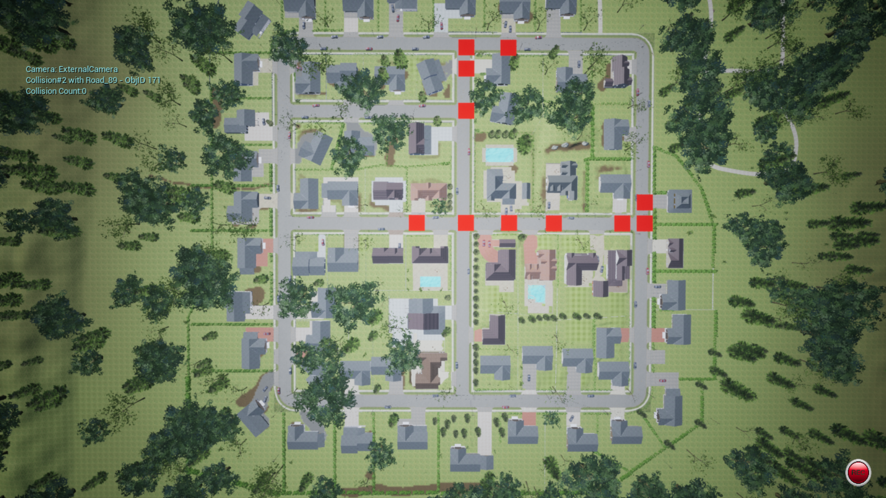
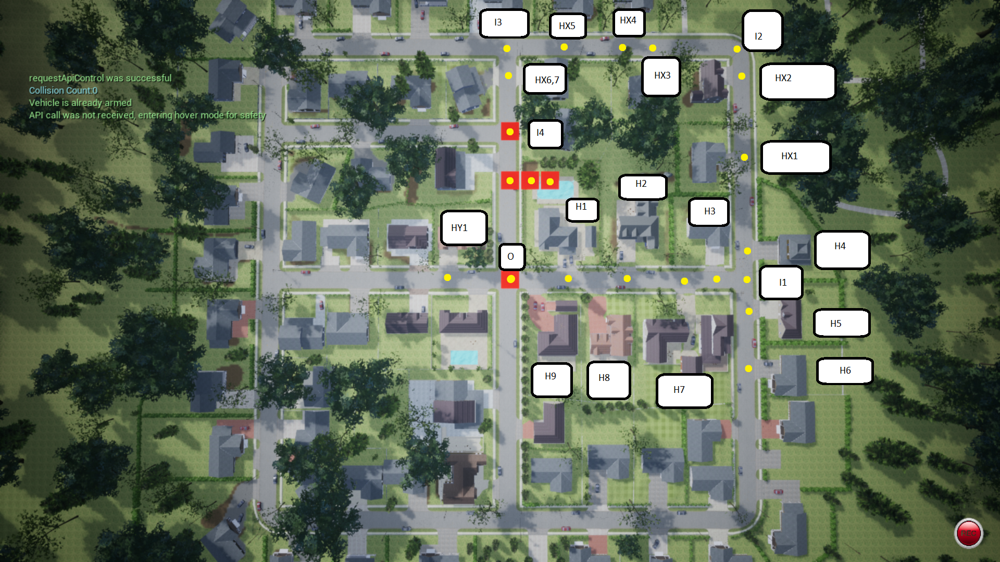

# COMP 361 - Final Project

**Check out the video of project**

Drones in AirSim

### Usage

 * Install required pip packages using `pip install -r requirements.txt`
 * Run the `AirsimNH` Map
 * Open a terminal/cmd
 * Start program with command: `py start.py`

### Map Guide

